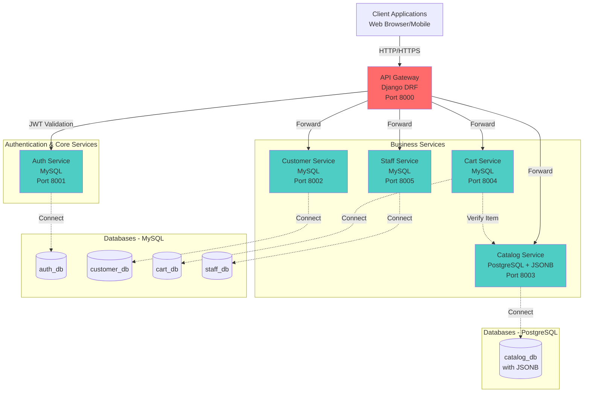
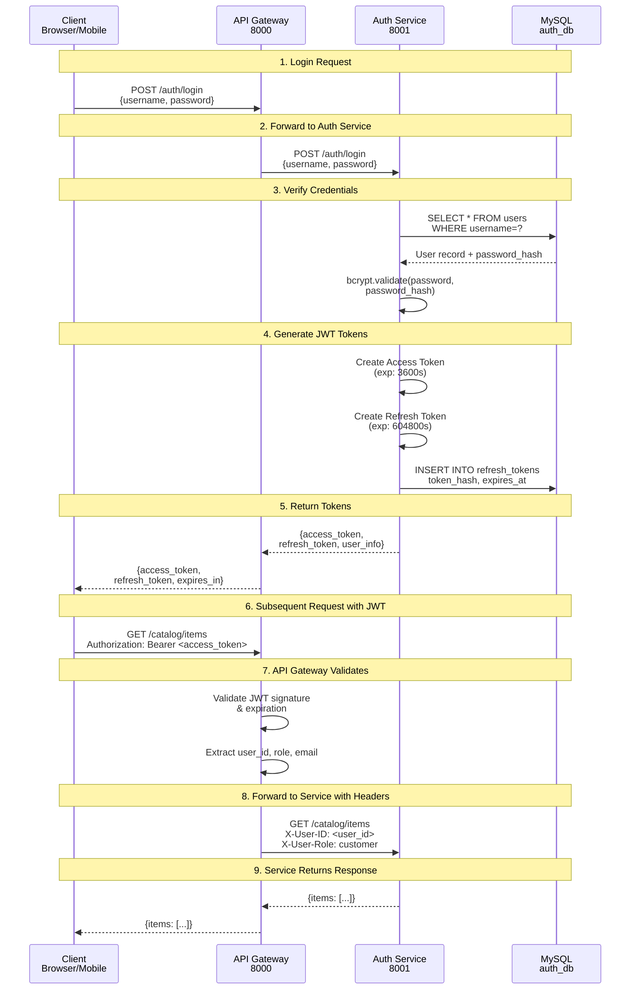
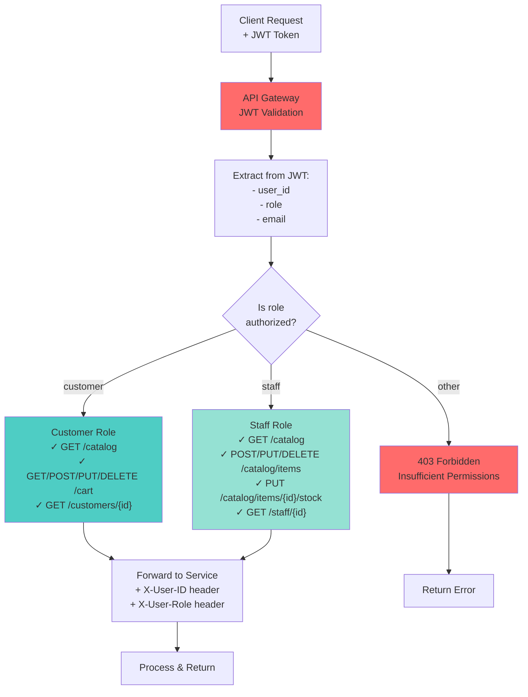
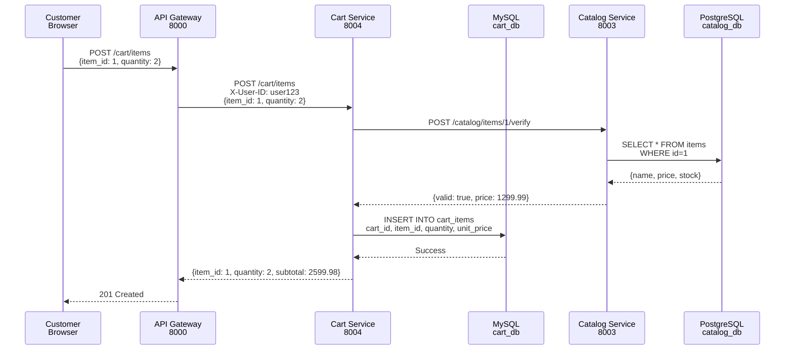
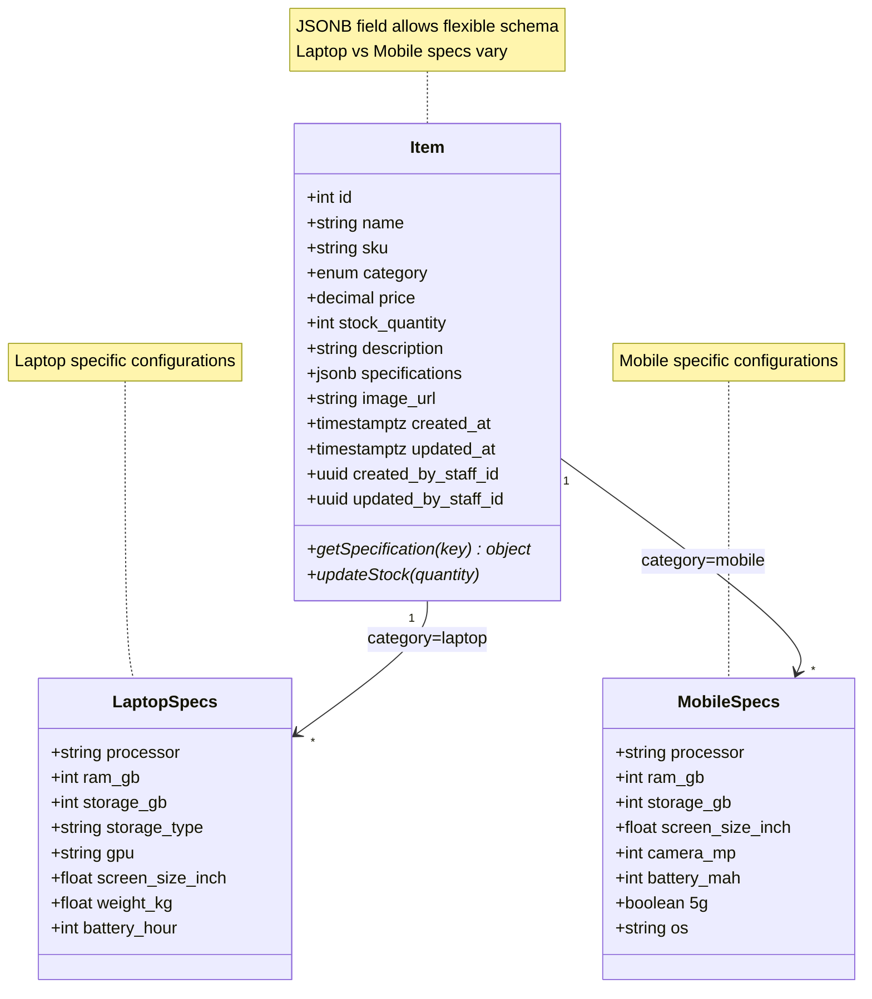
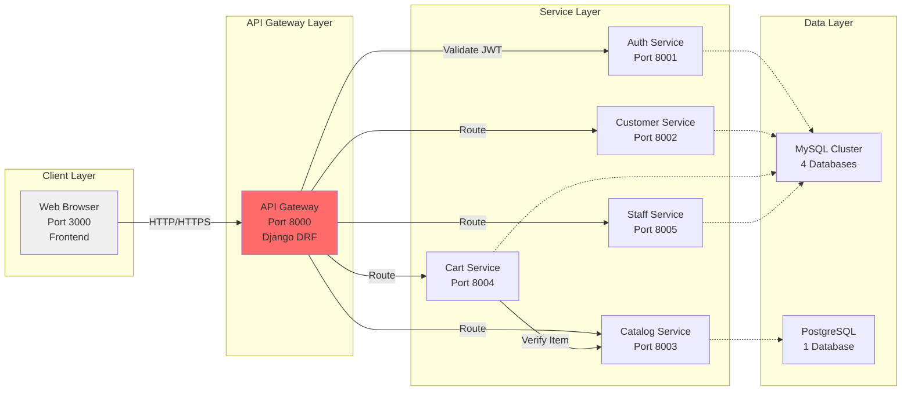
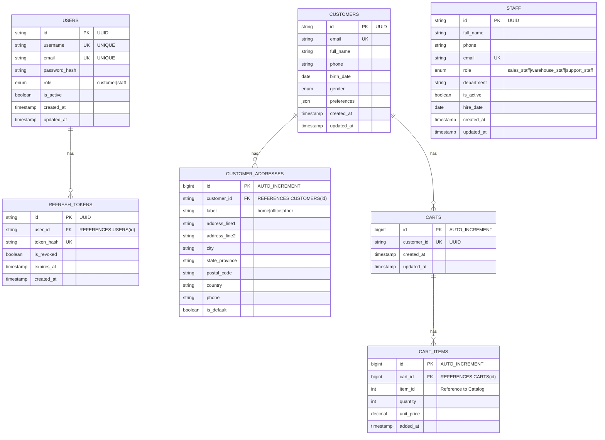
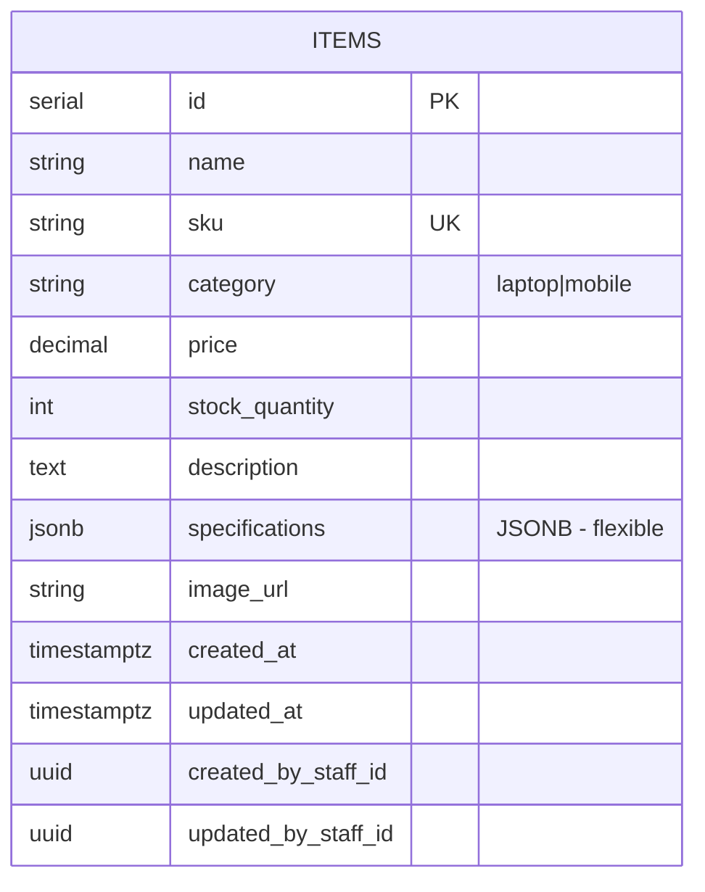
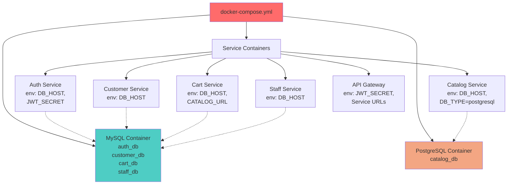

# Architecture Diagrams - Tech Device E-Commerce Microservices

Tài liệu này chứa các biểu đồ kiến trúc được vẽ bằng Mermaid.js.

---

## 1. System Architecture Overview

---

## 2. Authentication Flow

---

## 3. Role-Based Access Control (RBAC)

---

## 4. Cart to Catalog Verification Flow

---

## 5. Data Model: Catalog with JSONB Specifications

---

## 6. Service Communication Diagram

---

## 7. Database Schema Overview

### MySQL Schema

### PostgreSQL Schema (Catalog)

---

## 8. Environment Setup Flow

